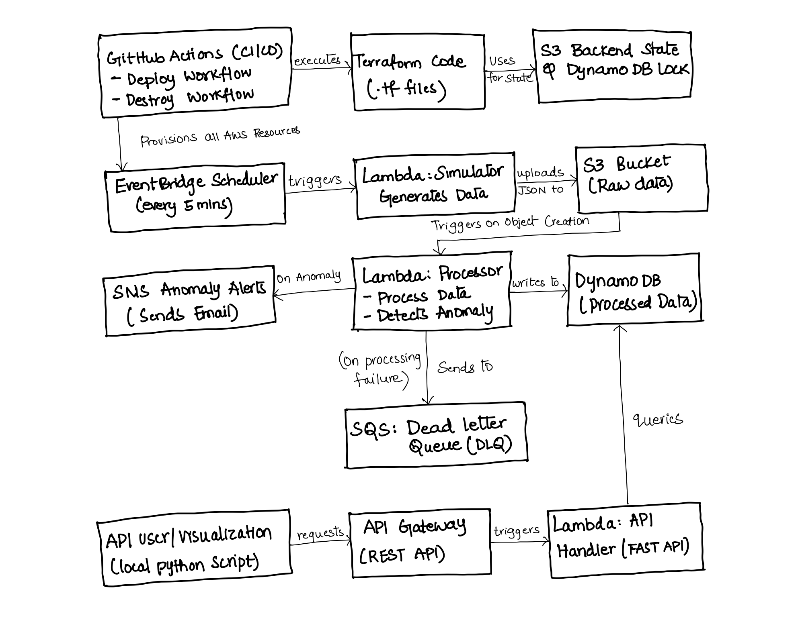
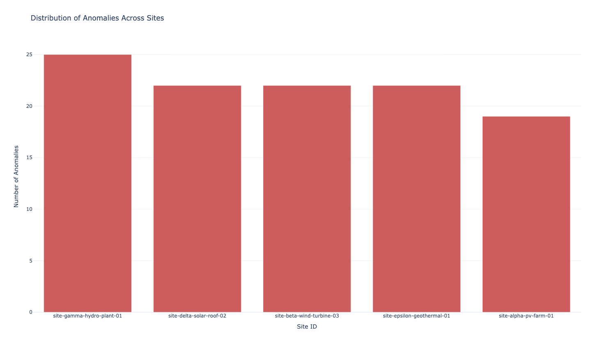
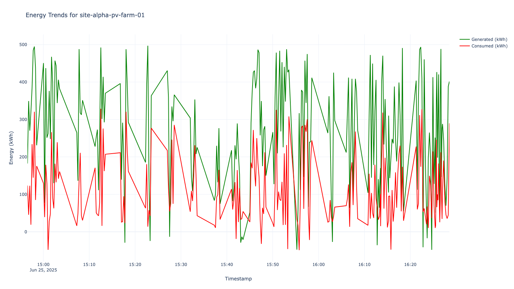
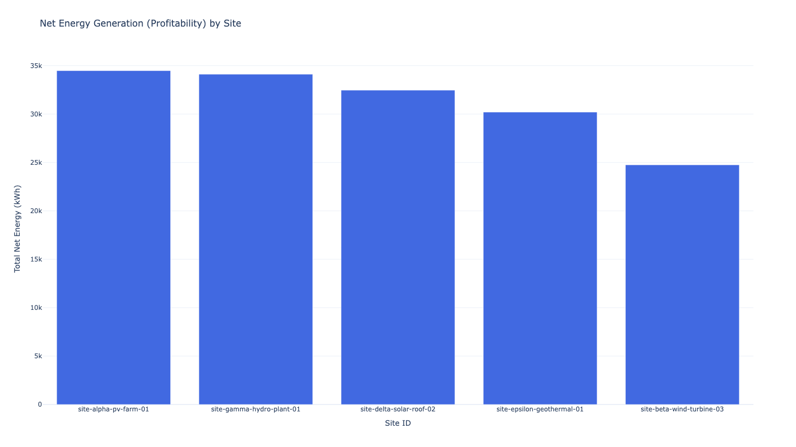
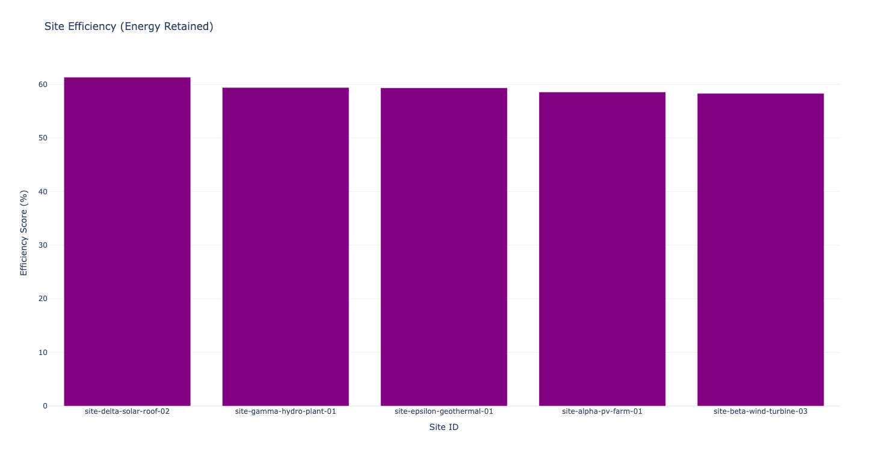

# Data Engineering Pipeline for Private Energy Partners
This repository contains the complete source code and infrastructure definition for a production-grade, serverless data pipeline built on AWS. This solution was developed to meet and exceed the requirements of the Data Engineering assignment, demonstrating a robust, scalable, and fully automated system for processing real-time energy data.

---

## Architecture Overview



The pipeline is designed around a serverless, event-driven architecture to ensure scalability and cost-efficiency. Each component is decoupled and performs a specific task, from data generation to storage and analysis. The flow is initiated by an EventBridge Scheduler, which triggers a Simulator Lambda every five minutes to generate a batch of mock data. This data is uploaded as a JSON file to an S3 Bucket. The file creation event in S3, in turn, triggers a Processor Lambda. This core function processes each record, calculates the net energy, identifies anomalies, and then writes the structured data to DynamoDB. If anomalies are found, it publishes an alert to an SNS Topic, and if the function fails entirely, the event is safely captured in an SQS Dead-Letter Queue.

Finally, the data is made available for analysis via a serverless API. The visualization script acts as the end-user, sending requests to API Gateway, which triggers an API Handler Lambda running a FastAPI application to query the DynamoDB table and return the processed data.

---

## Project Setup and Deployment

The entire infrastructure is managed via Terraform and deployed through a CI/CD pipeline in GitHub Actions.

### Prerequisites
1. An AWS Account with configured credentials for the AWS CLI.
2. A GitHub Account with the ability to create repositories and configure secrets.
3. Terraform v1.8
4. Python 3.9
5. Git

### Step 1: Backend Initialization (One-Time Setup)

Terraform state is managed remotely using an S3 bucket and DynamoDB table. This is a one-time setup task for the project.

**1a. Create Backend Resources**

```bash
# Create the S3 bucket to store Terraform state
aws s3api create-bucket \
    --bucket unique-bucket-name-for-terraform \
    --region us-east-1

# Enable versioning on the state bucket for safety
aws s3api put-bucket-versioning \
    --bucket unique-bucket-name-for-terraform \
    --versioning-configuration Status=Enabled

# Create a DynamoDB table for state locking
aws dynamodb create-table \
    --table-name terraform-state-lock \
    --attribute-definitions AttributeName=LockID,AttributeType=S \
    --key-schema AttributeName=LockID,KeyType=HASH \
    --billing-mode PAY_PER_REQUEST
```
**1b. Configure Terraform Backend**
In the terraform/backend.tf file, update the bucket attribute with the unique name just created.

---

### Step 2: Automated Deployment via CI/CD

The primary deployment method is by pushing code to this repository.
1. **Fork this repository** – create a fork of this project under your own GitHub account.  
2. **Configure secrets** – In your forked repository, go to **Settings → Secrets and variables → Actions** and add as repository secrets. The CI/CD workflow uses these to authenticate with AWS.
   * `AWS_ACCESS_KEY_ID`  
   * `AWS_SECRET_ACCESS_KEY` 

3. **Push to main** – any `git push` to the **main** branch automatically triggers the **Deploy** workflow.  
   The workflow packages the Lambda functions, runs `terraform init` and `terraform apply`, and deploys any infrastructure changes.

## Interacting with the Pipeline
### DynamoDB Schema
The primary data is stored in DynamoDB with the following schema, optimized for time-series queries per site.
| Attribute Name          | Type | Key | Description                       |
|-------------------------|------|-----|-----------------------------------|
| `site_id`               | S    | PK  | The unique identifier for an energy site.      |
| `timestamp`             | S    | SK  | ISO 8601 UTC record time           |
| `energy_generated_kwh`  | N    | —   | Generated energy (kWh)             |
| `energy_consumed_kwh`   | N    | —   | Consumed energy (kWh)              |
| `net_energy_kwh`        | N    | —   | The calculated net energy (generated - consumed).        |
| `anomaly`               | BOOL | —   | A flag indicating if the record is anomalous. |

### API Endpoints
After a successful deployment, the live API endpoint URL is available as an output in the Terraform Deploy step of the GitHub Actions log. The API provides the following endpoints:
* **GET /docs:** Renders interactive Swagger UI documentation for all endpoints.
* **GET /summary:** Provides a high-level summary of the entire system, including total records, anomaly counts, and a list of all site IDs.
* **GET /records/{site_id}:** Fetches all records for a specific site.
* **GET /records/{site_id}?start&end:** Fetches time bounded records.
* **GET /anomalies/{site_id}:** Retrieves all records flagged as an anomaly for a specific site.

### Testing the API
**1. Quick Test with curl:** You can test an endpoint directly from your terminal to verify the API is live. 
```bash
# Replace $API with the live URL
curl "$API/records/site-alpha-pv-farm-01"
curl "$API/records/site-alpha-pv-farm-01?start_date=2025-06-20T00:00:00Z&end_date=2025-06-25T23:59:59Z"
```
**2. Interactive Documentation:** Full, interactive API documentation is available at the `/docs` endpoint: `GET $API/docs`
### Running the Visualization Script
The `visualization/` directory contains a script to query the API and generate analytical charts.
#### Run Command:
1. **Navigate to Directory:** cd visualization
2. **Install Dependencies:** pip install -r requirements.txt
3. **Update API URL:** First, update the `API_BASE_URL` variable in visualize.py and run `python visualize.py`

This will generate several .html files in a charts/ subdirectory including trend analyses and site comparisons.

### Sample Analytics Output

This section provides a preview of the charts generated by the `visualization/visualize.py` script.

### See all generated charts

<details>
   <summary>click to expand</summary>
  
| Chart File Name | What it Shows |
| :--- | :--- |
| **** | A bar chart showing the total count of anomalies for each site, highlighting sites with frequent data issues. |
| **** | A time-series line chart for each site, comparing its energy generation vs. consumption over time. |
| ****| A bar chart comparing the total net energy (generation - consumption) of each site, indicating overall "profitability". |
| **** | A bar chart comparing the operational efficiency of each site (energy retained vs. generated). |

*All interactive HTML files are saved in the `visualization/charts/` directory after the script is run. Open them in a browser to explore the data.*

</details>

### Cost & Teardown
This project is designed to operate entirely within the AWS Free Tier. To prevent ongoing AWS costs, all Terraform-managed infrastructure can be destroyed via a dedicated, manually-triggered workflow.

1. Navigate to the `Actions` tab in your GitHub repository.
2. Select the `Destroy PEP Data Pipeline` workflow.
3. Click `Run workflow` to trigger the teardown process.

Note: The S3 backend bucket and DynamoDB lock table must be deleted manually from the AWS console as they are not managed by this Terraform configuration.

## Design Rationale

For a detailed explanation of the architectural and technical decisions made in this project including the choice of a serverless architecture, the use of a remote Terraform backend, and the API design. Please see the full design document.

**[View Detailed Design & Solution Rationale](docs/design_decisions.md)**
